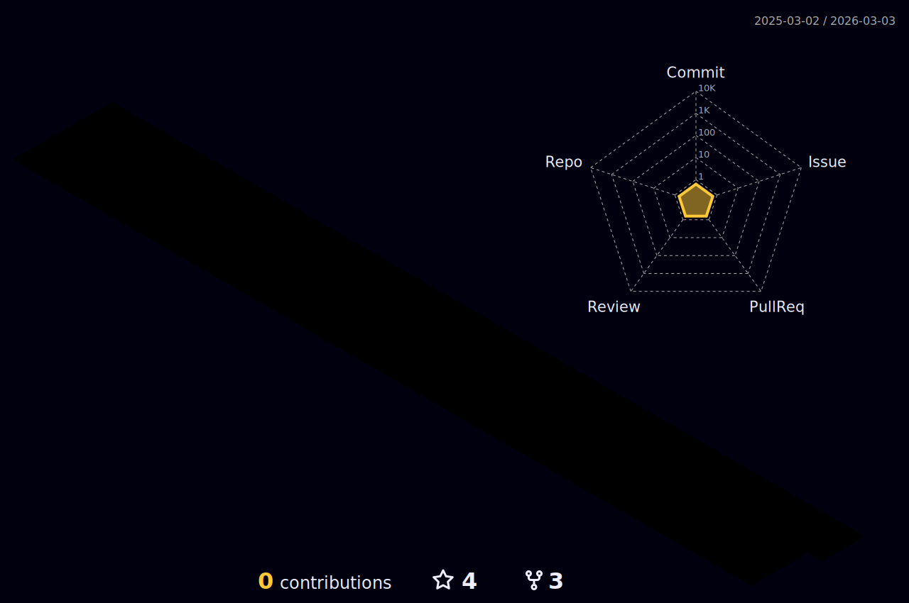

 

  
 

<!-- %7C -> alttaki yaziya | eklememize yariyor -->

   
<h3 align="left">Skills: Java | Selenium | JUnit | TestNG | Cucumber | Git - GitHub | Html - Css | JIRA | MySQL | LAMBDA | JDBC | API | </h3>
 
## <b> Languages and Tools:</b>
</a> 
   <a href="https://www.w3.org/html/" target="_blank" rel="noreferrer">    <a href="https://www.mysql.com/" target="_blank" rel="noreferrer"><a href="https://www.selenium.dev/" target="_blank" rel="noreferrer">  
 </a>
 
 

 

 
 
 
  
  

 

<!-- 

-->

 
 
##  <b>My Stats</b>

  
  
  

<!--  -->

